# 行情分析小程序

关于本行情分析小程序，主要用于行情数据的详细数据显示、分析以及数据图表显示。基本的设计、数据以及预测数据走势等依照股票分析软件来设计。

# 新版本介绍

## 2.0.0 版本 [2020-05-22]

### 新增内容

1. 增加设置页，自定义设置主题和自动登录
2. 新增历史查询功能
3. 新增就业数据可视化
4. 新增主题样式

### 修改内容

1. 整合主页、查询结果页的页面结构，采用模块化设计
2. 修改侧边栏内容，侧边栏自定义组件化
3. 修改搜索接口样式以及功能内容，并实现自定义组件化
4. 修改主页其他项显示内容，增加就业自定义组件
5. 修改全局样式，按照新的颜色结构重新设计
6. 优化数据设计，减少程序包体积和数据占用内存大小

## 1.5.0 版本 [2020-04-22]

### 新增内容

1. 完善国外基金详情页的设计显示

### 修改内容

1. 修改基金页的显示逻辑

## 1.4.9 版本 [2020-04-16]

### 新增内容

1. 新增主页国外基金显示，但暂时不支持该数据详情内容显示

### 修改内容

1. 优化部分过度动画
2. 重构部分样式，减小包体积
3. 修正主页等数据加载后滚动条没有重置问题

### 待优化内容

- [x] 国外基金详情内容显示

## 1.4.7 版本 [2020-04-08]

本版本基本是修复和补充内容

### 新增内容

1. 新增自选内容删除功能，自选页长按删除、详情页删除按钮
2. 新增基金历史数据
3. 新增自选数据功能

### 修改内容

1. 修改日K数据数据量为100
2. 查询功能修改为分类修改
3. 自选页显示修改为各类选项
4. 修改部分图标
5. 修改图表显示样式
6. 适配大屏幕设备显示
7. 指数内容完善

### 待优化内容

- [x] 计划其他项内容
- [x] 优化样式表
- [x] 优化显示渲染速度和登录优化

## 1.4.3 版本 [2020-04-01]

本版本图表进行了重新绘制，弃用了原来的制图底层代码，改用了echarts组件代码重新封装。

### 新增内容

1. 新增美股、基金数据
2. 新增基金页面板块
3. 新增图表功能区以及标签选择

### 修改内容

1. 修改了详情页内容
2. 修改了数据库连接参数

### 待修改内容

- [x] 基金页显示内容优化
- [x] 部分指数数据已获取，修改指数详细数据显示
- [x] 搜索页、自选页内容优化(包括各类数据)

## 1.4.0 版本 [2020-03-25]

### 新增内容

1. 完成自选页排序功能
2. 新增图表手指缩放

### 修改内容

1. 修改图表缩放按钮

### 待修改内容

- [x] 图表手指缩放有部分异常，待修复
- [x] 详细页部分图表层级出现问题

## 1.3.0 版本 [2020-03-19]

### 新增内容

1. 完成自选页面设计以及自选基本功能
2. 详细页新增五日、月K、年K图表显示，基本实现图表比例尺和同步移动功能
3. 登录功能实现、登录功能与自选页内容绑定
4. 主页下拉刷新和分页功能实现
5. 基本的交互功能、提示功能完成

### 修改内容

1. 重新调整页面设计
2. 详细页图表更改为K线图和成交量柱形图
3. 详细页数据划分以及格式化

### 待修改内容

- [x] 自选页排序以及自选内容删除功能
- [x] 自定义图表显示功能
- [x] 优化图表缩放

## 1.1.1 版本 [2020-03-11]

### 新增内容

1. 数据库数据获取api
2. 数据库数据绑定和动态绘制
3. 页面排序按钮
4. 数据格式化和图表动态绘制

### 修改内容

1. 数据定义更新、与数据库数据同步

### 需要修改内容

- [x] 数据库字段比原设计字段少`type`、`sell`等，缺失`指数`、`板块`等数据，需要重新设计显示样式。(改为根据可获取字段显示)
- [x] 图表原设计根据`分时`、`日`、`周`、`月`等绘制图表，目前数据只有日数据，需要重新设计绘表内容。

# 概况

设计主要按照以下几个步骤进行。

- [x] [页面设计](#页面设计)(二次设计完成)
- [x] [静态页面编写](#静态页面编写)
- [x] [动态数据及传参](#动态数据及传参)
- [x] [图表设计及代码](#图表设计及代码)(基本完成)
- [x] [函数、功能等设计](#函数功能等设计)(基本实现)
- [x] [数据库数据获取api](#数据库数据获取api)
- [x] [后续功能修改或增加](#后续功能修改或增加)

完成进度看 [**版本介绍**](#新版本介绍)，后续会根据需要做相应的调整、修改。

体验版可扫下面的二维码：


	
**注意**：由于目前采用数据的来源为纯ip链接，体验版需要点击右上角的`...`更多选项里选择开发调试，才能完成体验小程序数据显示等功能。

## 页面设计

目前页面设计，根据最新的要求和功能实现，绘制了新的页面以及所有页面进行或多或少的修改。现阶段已经经行了二次设计，具体可看[二次设计图样](#二次设计图样)。

### 初步页面设计

参考东方财富、智与良投等行情软件，加上自己的设计思路，初步界面设计如下图:

<div align="center">
  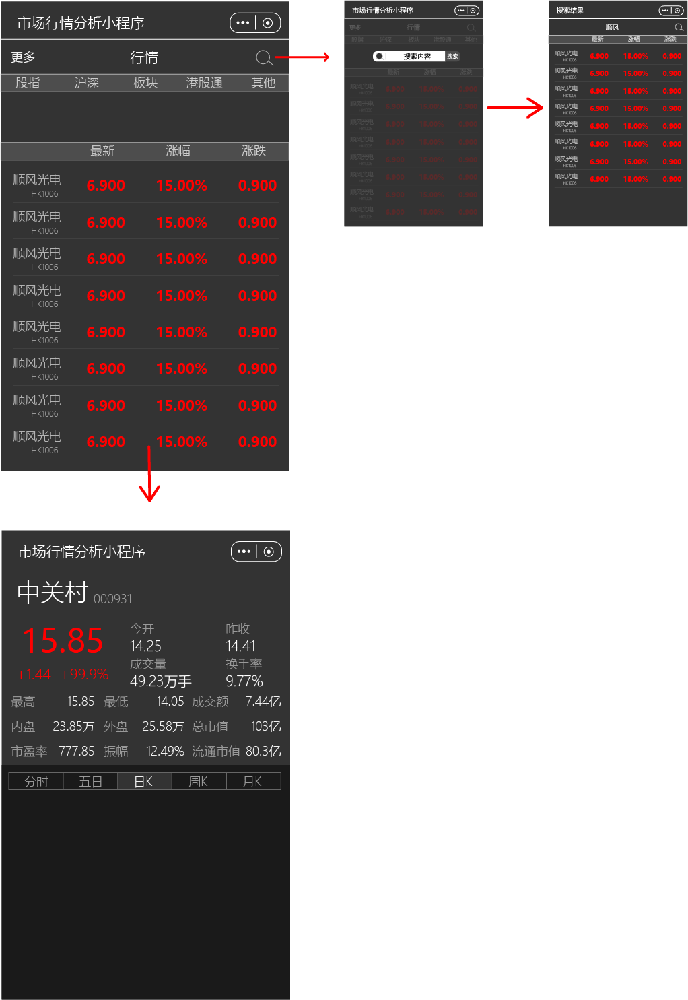
</div>

初步设计方案中，包括了主页（index）、详细数据页（details）和搜索页（seach）三页。每页中都有搜索图标、点击输入搜索内容即可跳转或更新到搜索页面。主页主要是预览和排序、比较各支股票等大概信息；详细数据页包含了该股票的各项信息！（具体由所获得的数据做具体调整）、走势图、预测图等；搜索数据页与主页相差无几。

### 一次设计图样

<div align="center">
  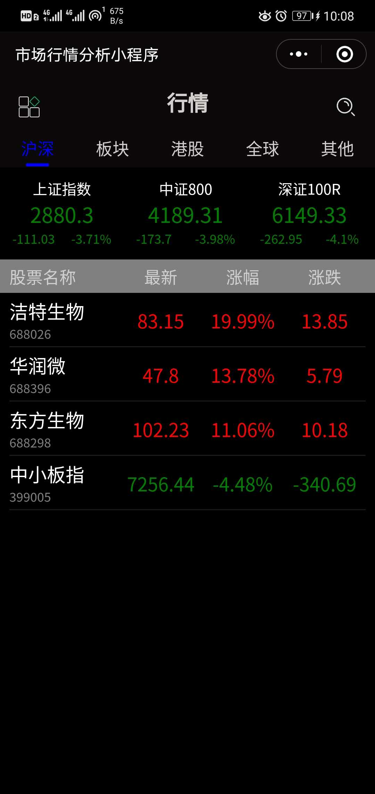
  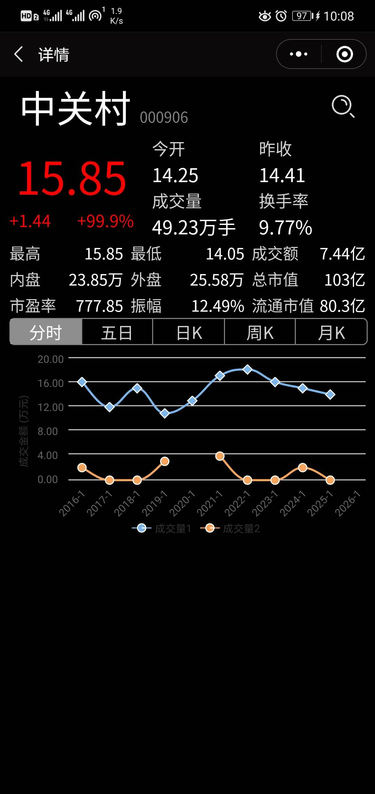
  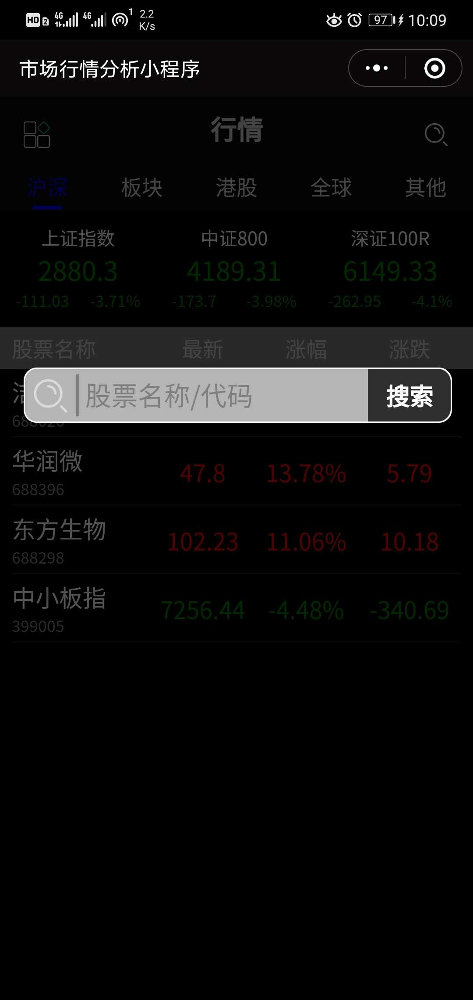
  
</div>

### 二次设计图样

二次设计的主要变化如下图所示。主页增加侧边栏，用于实现基本登录和页面导向功能；详细数据页增加添加到自选股票列，重新设计了图表增加基本图表缩放功能；自选页基本与主页类似。其余的小改动不做图片展示，基本是优化显示效果。

<div align="center">
  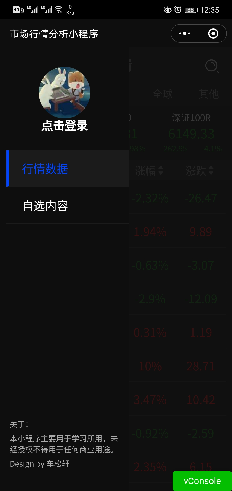
  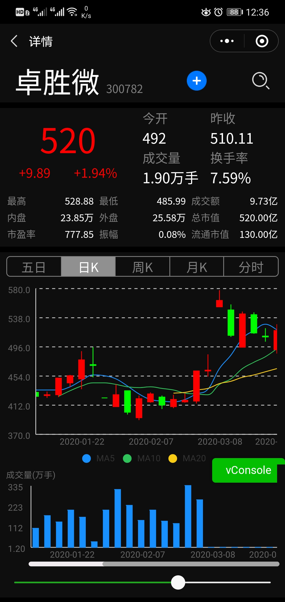
  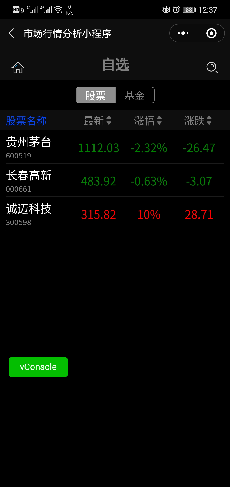
</div>

### 最终实现方案

最终方案采用主题方案，采用深色和浅色两种设计方案结合，主题颜色以不同的百分比递进明暗度来确定主题颜色。

<div align="center">
  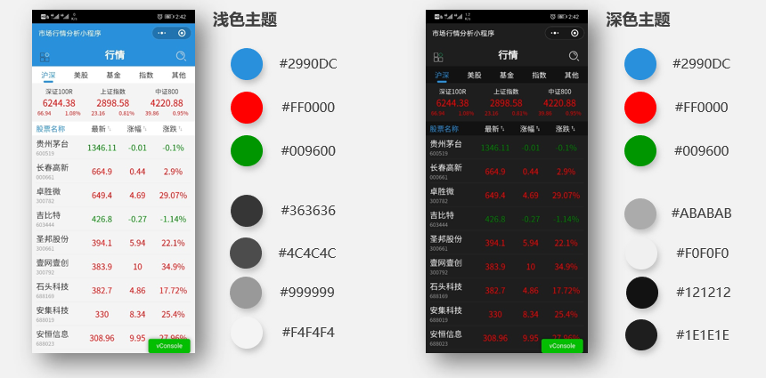
</div>

最后的页面设计确定为6个页面：主页、自选页、搜素页、基金类详情页、非基金类详情页、设置页。

#### 主页
<div align="center">
  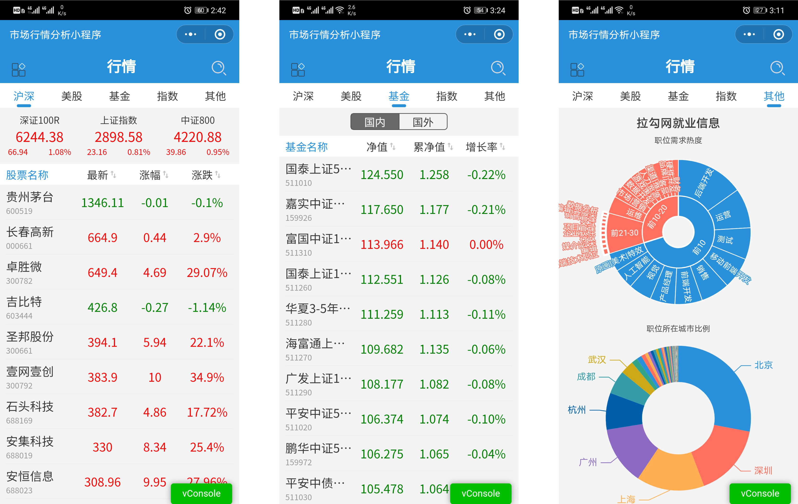
</div>

#### 自选页以及侧边栏
<div align="center">
  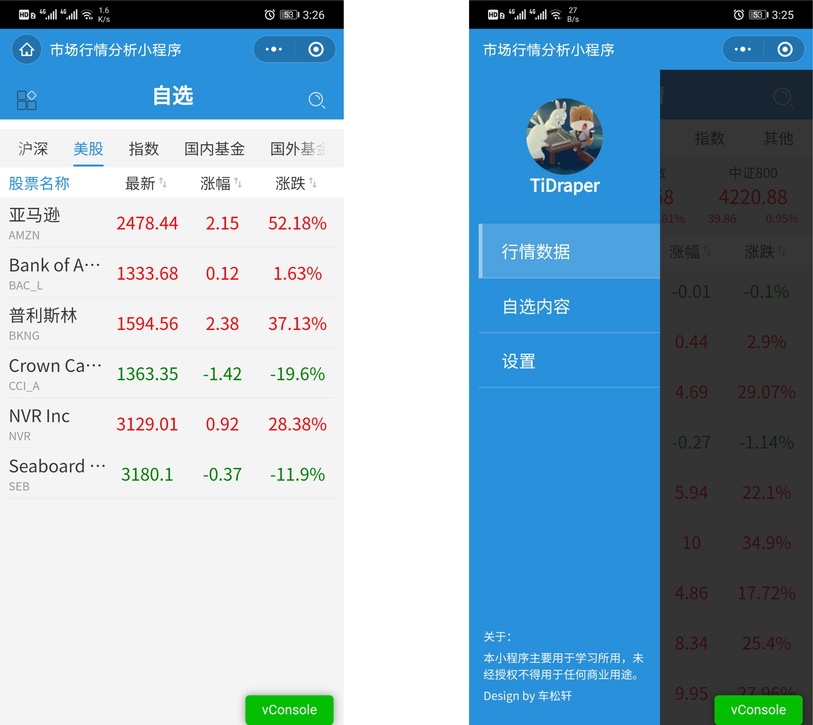
</div>

#### 搜索页以及搜索接口
<div align="center">
  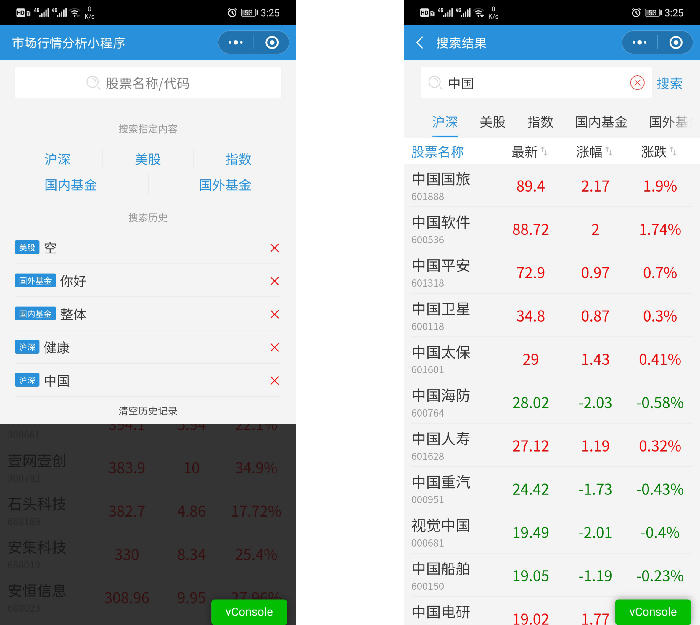
</div>

#### 基金类详情页
<div align="center">
  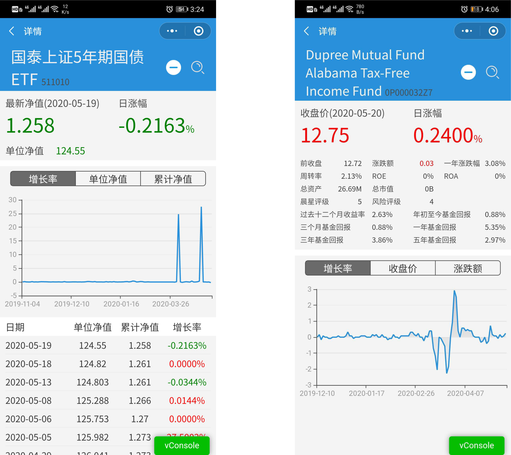
</div>

#### 非基金类详情页
<div align="center">
  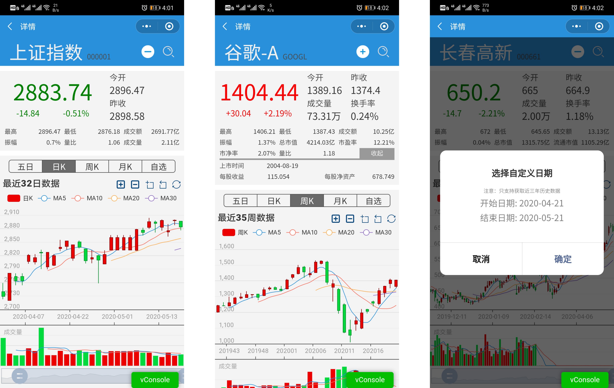
</div>

#### 设置页
<div align="center">
  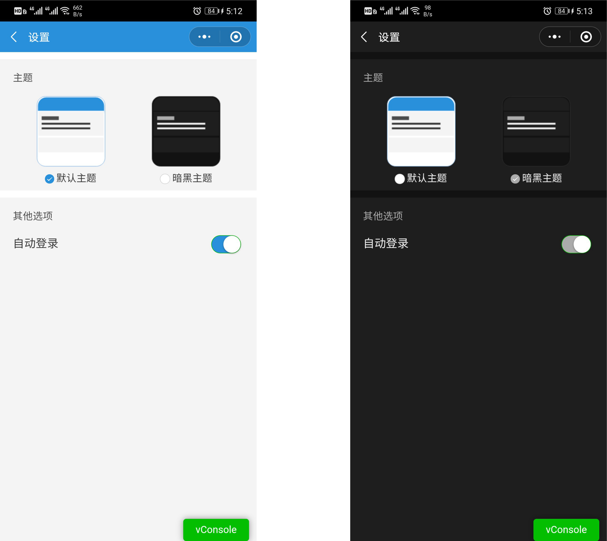
</div>

## 静态页面编写

根据设计方案，先编写静态页面。主要是编写wxml、wxss两种文件，一个是负责页面布局、一个是负责页面样式。目前为止，此部分基本完成。主页（index）、详细数据页（details）和搜索页（seach）三页的静态样式和页面都已全部完成在对应的文件夹下，此三页都已进入下一步骤。

目前已经新增了自选内容（my_select）页，该页内容也基本完成。

## 动态数据及传参

根据编写完成的静态页面做相应的调整，主要是页面跳转的传值问题和动态数据和布局问题。

关于传参问题，目前采用通用的地址附带参数的方式，即：url?values=数据内容。因为预设采用传股票的代码信息，再利用该信息查询数据库的方式，所以这种方式相对简单实用。

关于动态数据问题，目前自定义一套数据定义，具体如下：
```
/**
 * code:代码
 * name:名称
 * date:日期
 * current:当前价
 * previousClose:昨收价
 * quoteChange:涨幅 (当前-昨收)/昨收
 * change:涨跌 (当前-昨收)
 * openingPrice:今开盘
 * volume:成交量
 * turnoverRate:换手率
 * maxPrice:最高
 * minPrice:最低
 * turnover:成交额 (买入成交额+卖出成交额)
 * sell:内盘（缺失数据）
 * buy:外盘（缺失数据）
 * totalMarketCapitaliza:总市值(亿元)
 * pe:市盈率（缺失数据）
 * amplitude:振幅 （当日最高点的价格－当日最低点的价格）/前收价
 * marketCapitalization:流通市值
 */
```
采用上述定义来对静态页面修改数据。同时利用微信的`wx:for`、`wx:if`等函数实现动态数据加载和动态样式修改。

## 图表设计及代码

目前图表的设计和代码已经更改为uCharts开源工具，开源地址：https://gitee.com/uCharts/uCharts。 该代码目前有部分自己优化，待进一步优化。

后续会考虑自编图表代码或者优化、修该已有插件代码实现更为优化图表。

## 函数、功能等设计

目前该部分还尚未达到，**主要预设的功能有：**

- [x] 自选股票等相关内容（包含登录）
- [ ] 数据比较
- [ ] 数据动态预测
- [x] 实时同步

**预设函数部分有:**

- [x] 数据排序
- [x] 登录获取用户相关信息
- [ ] 数据预测

## 数据库数据获取api

此部分是编写数据库数据获取的主要部分，接下来主要测试这一部分。

## 后续功能修改或增加

根据需求和现实情况做动态调整，目前预计的增添、修改如下：

- [x] 个人信息页面
- [ ] 数据比较页面

## 参考文档

- [云开发文档](https://developers.weixin.qq.com/miniprogram/dev/wxcloud/basis/getting-started.html)
- [小程序组件开发文档](https://developers.weixin.qq.com/miniprogram/dev/component/)
- [小程序API开发文档](https://developers.weixin.qq.com/miniprogram/dev/api/)
- [uCharts说明文档](http://doc.ucharts.cn/1073940)

